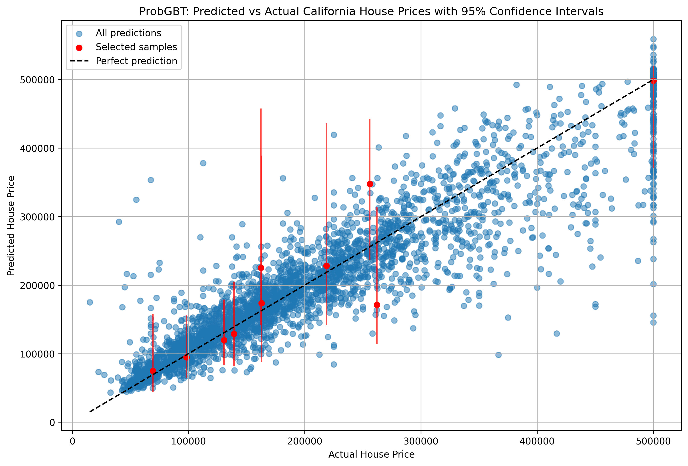
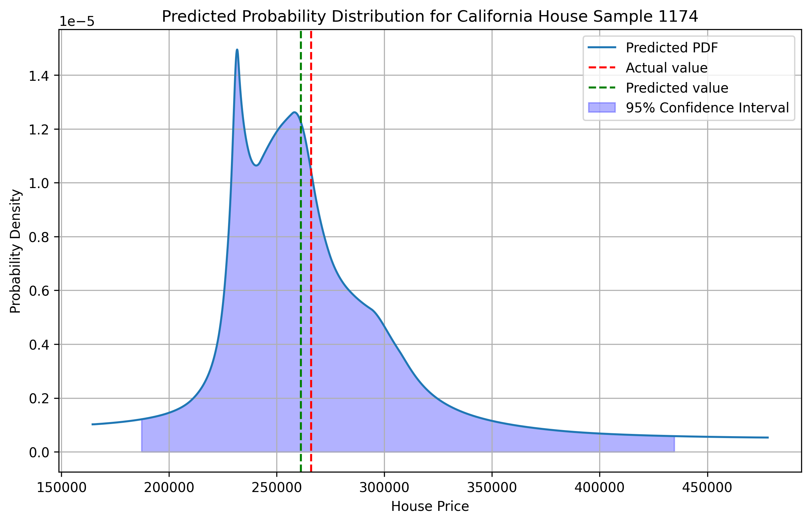
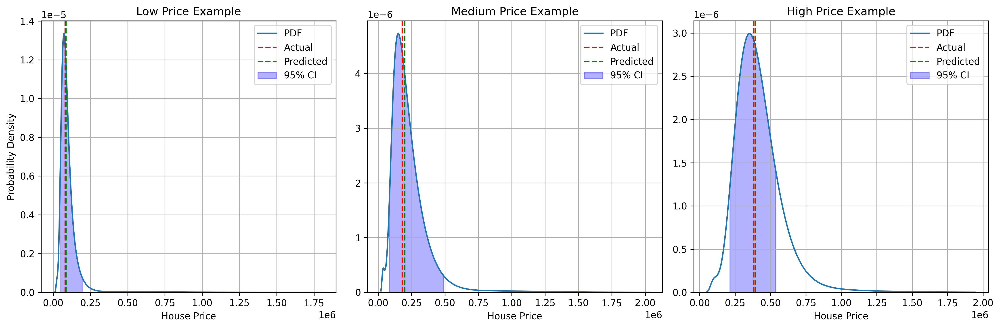
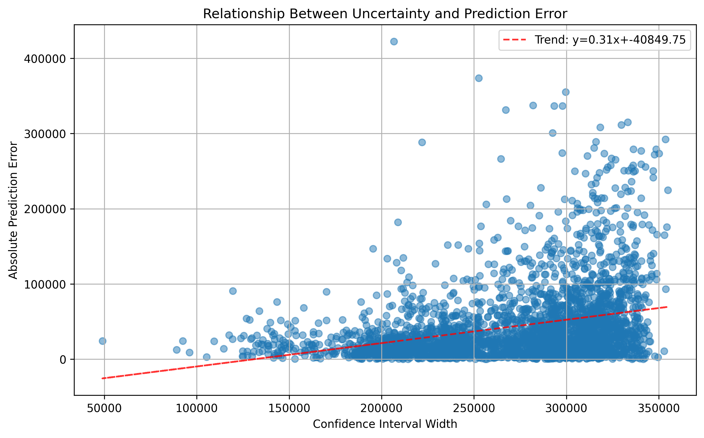
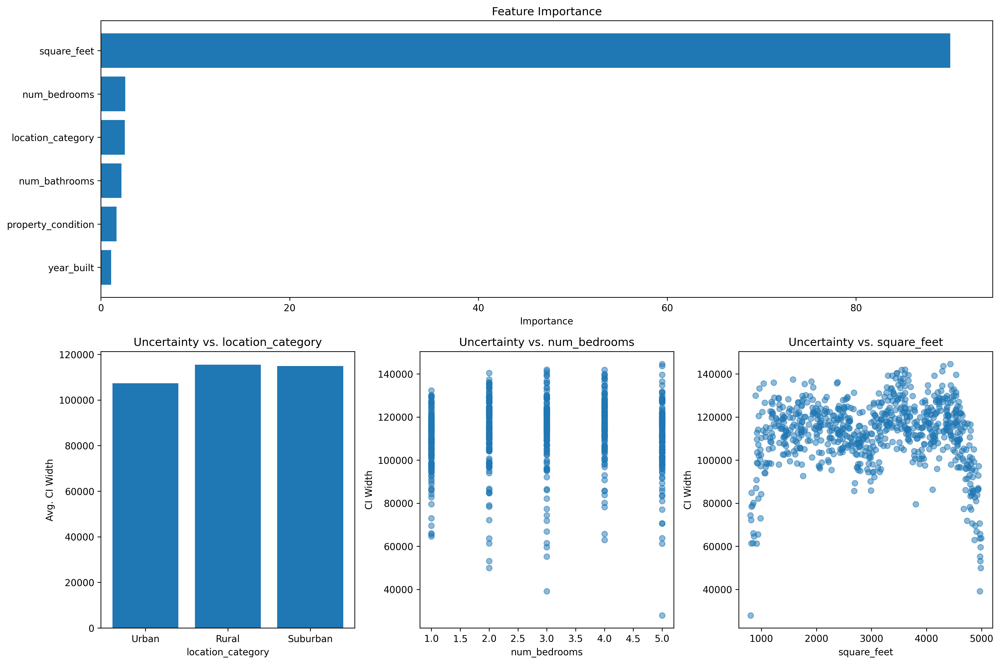
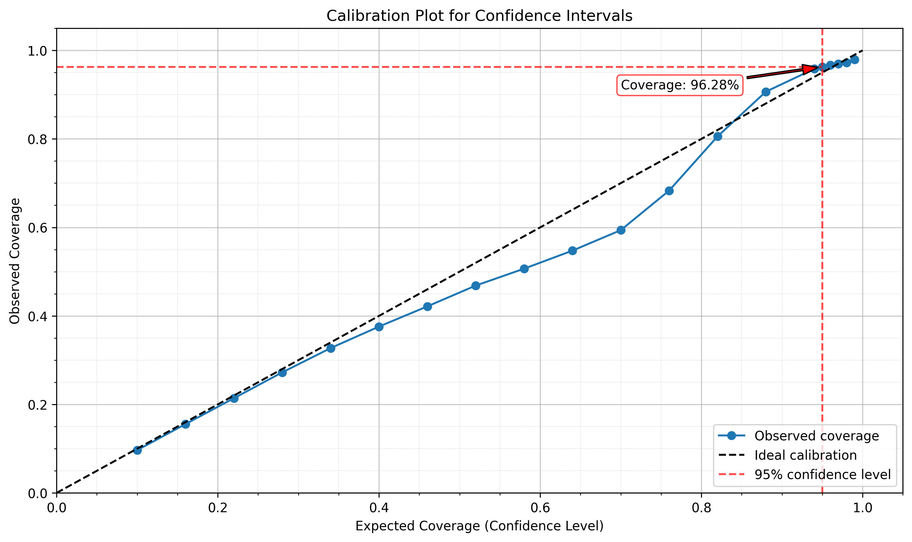

# ProbGBT: Probabilistic Gradient Boosted Trees

ProbGBT is a probabilistic machine learning model that extends gradient boosted trees to provide uncertainty estimates. It uses CatBoost's MultiQuantile loss function to predict multiple quantiles of the target distribution, then constructs a probability density function (PDF) from these quantiles.

## Features

- **Uncertainty Estimation**: Provides confidence intervals and probability distributions for predictions
- **Non-parametric**: Makes no assumptions about the shape of the target distribution
- **Flexible**: Works with both numerical and categorical features
- **Efficient**: Built on top of CatBoost's fast gradient boosting implementation
- **Multiple Training Strategies**: Supports both single model with MultiQuantile loss and separate models for each quantile
- **Calibrated Predictions**: Uses conformal prediction to ensure statistically valid confidence intervals

## Example Visualizations

### Predictions with Confidence Intervals



*Scatter plot showing predicted vs actual values with 95% confidence intervals for selected samples.*

### Probability Density Functions

<table>
  <tr>
    <td></td>
  </tr>
  <tr>
    <td></td>
  </tr>
</table>

*Top: Detailed probability density function for a single example, showing the predicted distribution, actual value, and 95% confidence interval.*

*Bottom: PDFs for houses in different price ranges (low, medium, high), demonstrating how the model captures different uncertainty patterns.*

### Uncertainty Analysis



*Relationship between confidence interval width and prediction error, showing how larger uncertainty correlates with larger errors.*



*Feature importance and its relationship with prediction uncertainty, demonstrating which features contribute most to the model's predictions and uncertainty.*



*Calibration plot showing how well the predicted confidence intervals match the observed coverage, with a focus on the 95% confidence level.*

## Installation

```bash
# Clone the repository
git clone https://github.com/yourusername/ProbGBT.git
cd ProbGBT

# Install dependencies
pip install -r requirements.txt
```

Or using Poetry:

```bash
# Install dependencies with Poetry
poetry install

# Run the example
poetry run run-example
```

## Dependencies

- numpy
- pandas
- catboost
- scipy
- scikit-learn
- pygam
- matplotlib
- tqdm

## Usage

### Basic Example

```python
from prob_gbt import ProbGBT
from sklearn.model_selection import train_test_split

# Prepare your data
X_train, X_test, y_train, y_test = train_test_split(X, y, test_size=0.2)

# Initialize and train the model
model = ProbGBT(num_quantiles=50, iterations=500, train_separate_models=False)
model.train(X_train, y_train, cat_features=cat_features)

# Make point predictions
y_pred = model.predict(X_test)

# Get confidence intervals
lower_bounds, upper_bounds = model.predict_interval(X_test, confidence_level=0.95)

# Get full probability distributions
pdfs = model.predict_pdf(X_test)

# Using GMM smoothing for more robust distributions (for multi-modal data)
lower_gmm, upper_gmm = model.predict_interval(X_test, confidence_level=0.95, method='gmm')
pdfs_gmm = model.predict_pdf(X_test, method='gmm')
```

### Using Calibration

```python
# Initialize a model with calibration enabled
model = ProbGBT(
    num_quantiles=50,
    iterations=500,
    calibrate=True  # Enable calibration
)

# Train the model with calibration
# A portion of the training data will be used for calibration
model.train(
    X_train, y_train,
    cat_features=cat_features,
    calibration_size=0.2  # Use 20% of training data for calibration
)

# Alternatively, provide a separate calibration set
model.train(
    X_train, y_train,
    cat_features=cat_features,
    calibration_set=(X_cal, y_cal)  # Use separate calibration data
)

# Get calibrated confidence intervals
lower_bounds, upper_bounds = model.predict_interval(X_test, confidence_level=0.95)

# Get calibrated PDFs
pdfs = model.predict_pdf(X_test, use_calibration=True)

# Evaluate calibration quality
calibration_results = model.evaluate_calibration(X_val, y_val)
print(calibration_results)
```

### Example Script

The repository includes an example script that demonstrates how to use ProbGBT with the California housing prices dataset:

```bash
# Using Python directly
python run_example.py

# Using Poetry
poetry run run-example
```

This will:
1. Load the California housing prices dataset
2. Train a ProbGBT model
3. Make predictions with uncertainty estimates
4. Calculate performance metrics
5. Generate visualizations in the 'images' directory

## How It Works

ProbGBT works by:

1. **Quantile Transformation**: Generating non-uniformly spaced quantiles with more focus on the tails of the distribution
2. **Multi-Quantile Regression**: Training a CatBoost model to predict multiple quantiles simultaneously (or separate models for each quantile)
3. **Smoothing**: Using Generalized Additive Models (GAMs) to smooth the quantile function
4. **PDF Estimation**: Computing the derivative of the smoothed quantile function to obtain the probability density function
5. **Calibration** (optional): Using conformal prediction to ensure statistical validity of the confidence intervals

### Technical Details on PDF Generation

The PDF generation process in ProbGBT involves several sophisticated steps:

1. **Non-uniform Quantile Generation**: 
   - Instead of using uniformly spaced quantiles, ProbGBT transforms them using the normal distribution's PPF (Percent Point Function) and CDF (Cumulative Distribution Function)
   - This places more focus on the tails of the distribution, improving the model's ability to capture extreme values
   - The transformation uses: `non_uniform_quantiles = norm.cdf(norm.ppf(uniform_quantiles) * 3)`

2. **Quantile Prediction with CatBoost**:
   - The model can use either:
     - CatBoost's MultiQuantile loss function to predict all quantiles simultaneously (default)
     - Separate CatBoost models for each quantile (when `train_separate_models=True`)
   - The first approach ensures consistency between quantiles and improves computational efficiency
   - The second approach may provide more flexibility for complex distributions

3. **Quantile Function Smoothing**:
   - Raw quantile predictions can be noisy and may not form a proper monotonically increasing function
   - A Generalized Additive Model (GAM) with monotonicity constraints is fitted to the predicted quantiles:
     ```python
     gam = LinearGAM(s(0, constraints="monotonic_inc")).fit(quantiles, y_pred_sample)
     ```
   - This creates a smooth, monotonically increasing quantile function

4. **PDF Calculation**:
   - The PDF is computed as the derivative of the quantile function with respect to the probability
   - Mathematically, if Q(p) is the quantile function, then PDF(y) = 1/Q'(F(y)) where F is the CDF
   - In code, this is approximated using numerical differentiation:
     ```python
     pdf_smooth = np.gradient(quantiles_smooth, y_pred_smooth + epsilon)
     ```
   - The small epsilon value (1e-10) prevents division by zero in flat regions

5. **PDF Normalization**:
   - The resulting PDF is normalized to ensure it integrates to 1.0, making it a valid probability density function:
     ```python
     pdf_smooth /= np.trapz(pdf_smooth, y_pred_smooth)
     ```
   - This uses the trapezoidal rule for numerical integration

6. **Gaussian Mixture Model (GMM) Smoothing**:
   - In addition to spline-based smoothing, ProbGBT offers an optional GMM-based smoothing method
   - GMM fits a mixture of Gaussian distributions to the data, providing a more robust representation for complex distributions
   - This can be enabled by setting `method='gmm'` in the `predict_pdf()` or `predict_interval()` functions:
     ```python
     pdfs = model.predict_pdf(X_test, method='gmm')
     lower, upper = model.predict_interval(X_test, confidence_level=0.95, method='gmm')
     ```
   - GMM smoothing can better capture multi-modal distributions and provides smoother estimates
   - The implementation uses scikit-learn's GaussianMixture with 3 components by default
   - The model includes sophisticated failure detection to fall back to spline smoothing when GMM fails to converge or produces unreliable distributions

### Calibration Process

The calibration feature in ProbGBT uses conformal prediction to ensure that the predicted confidence intervals have the correct coverage probability. Here's how it works:

1. **Calibration Set Creation**:
   - During training, a portion of the data is reserved for calibration
   - This can be either a split from the training data (specified by `calibration_size`) or a separate provided dataset (`calibration_set`)

2. **Nonconformity Scores**:
   - For each quantile level α, the model computes nonconformity scores on the calibration set
   - For the quantile q_α(X), the nonconformity score is: E_i = y_i - q_α(X_i)
   - These scores represent how much the true values deviate from the predicted quantiles

3. **Empirical Quantile Adjustment**:
   - For each desired quantile level α, the model finds s_hat such that:
     P(y - q_α(X) ≤ s_hat) = α
   - This is calculated as the empirical (n+1)α/n quantile of the nonconformity scores
   - The adjusted prediction is then: q_α_cal(X) = q_α(X) + s_hat

4. **Interval Calculation**:
   - For calibrated models, confidence intervals directly use the calibrated quantiles
   - For a (1-α) confidence interval, the lower bound uses the α/2 quantile and the upper bound uses the (1-α/2) quantile
   - These intervals have a theoretical guarantee to include the true value with at least the specified probability

5. **PDF from Calibrated Quantiles**:
   - When `use_calibration=True` in `predict_pdf()`, the smoothed PDF is constructed from the calibrated quantiles
   - This ensures the PDF is consistent with the calibrated confidence intervals
   - The resulting PDFs maintain statistical validity while providing smooth, continuous distributions

The calibration process ensures that the model's uncertainty predictions are statistically valid and well-calibrated. This is particularly important in high-stakes applications where reliable uncertainty estimates are critical.

## API Reference

### ProbGBT Class

```python
ProbGBT(
    num_quantiles=50,
    iterations=500,
    learning_rate=None,
    depth=None,
    subsample=1.0,
    random_seed=42,
    train_separate_models=False,
    calibrate=False
)
```

#### Parameters:

- `num_quantiles`: Number of quantiles to predict (default: 50)
- `iterations`: Maximum number of trees to build (default: 500)
- `learning_rate`: Learning rate for the gradient boosting algorithm (default: None, uses CatBoost default)
- `depth`: Depth of the trees (default: None, uses CatBoost default)
- `subsample`: Subsample ratio of the training instances (default: 1.0)
- `random_seed`: Random seed for reproducibility (default: 42)
- `train_separate_models`: If True, train separate models for each quantile instead of using MultiQuantile loss (default: False)
- `calibrate`: If True, use conformal prediction to calibrate predicted quantiles (default: False)

#### Methods:

- `train(X, y, cat_features=None, eval_set=None, use_best_model=True, verbose=True, calibration_set=None, calibration_size=0.2)`: Train the model
- `predict(X, return_quantiles=False)`: Make predictions
- `predict_interval(X, confidence_level=0.95, method='spline', num_points=1000)`: Predict confidence intervals
- `predict_pdf(X, num_points=1000, method='spline', use_calibration=True)`: Predict probability density functions
- `evaluate_calibration(X_val, y_val, confidence_levels=None)`: Evaluate calibration quality on validation data
- `predict_distribution(X, confidence_levels=None, method='spline', num_points=1000)`: Get both calibrated intervals and smoothed PDFs
- `save(filepath, format='cbm', compression_level=6)`: Save the trained model to a file
- `load(filepath, format='cbm')`: Load a saved model from a file

### Save and Load Functionality

ProbGBT models can be saved to disk and loaded later for inference:

```python
# Save a trained model
model.save("model.cbm")  # For single model approach
model.save("models.tar.xz")  # For separate models approach

# Load a model
loaded_model = ProbGBT()
loaded_model.load("model.cbm")  # Load single model
loaded_model.load("models.tar.xz")  # Load separate models
```

#### Save Method

```python
save(filepath, format='cbm', compression_level=6)
```

- `filepath`: Path to save the model. For separate models, use a `.tar.xz` extension.
- `format`: Format for saving individual models. Options: 'cbm' (CatBoost binary), 'json'
- `compression_level`: Compression level for xz compression (1-9, where 9 is highest). Only used with separate models.

For the single model approach (when `train_separate_models=False`), this uses CatBoost's native `save_model` method.
For the separate models approach (when `train_separate_models=True`), this saves each model separately and compresses them into a tar.xz file with progress bars for monitoring.

#### Load Method

```python
load(filepath, format='cbm')
```

- `filepath`: Path to the saved model file.
- `format`: Format of the saved model. Only used for loading individual models from a tar.xz archive.

The method automatically detects whether the file is a single model or an archive of separate models based on the file extension.

## License

MIT