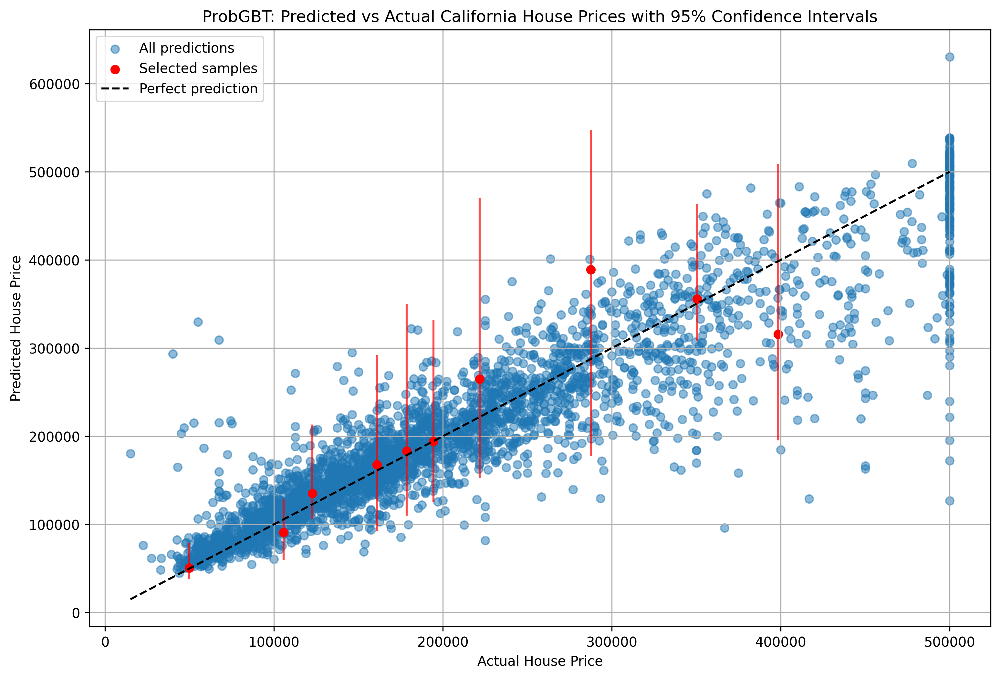
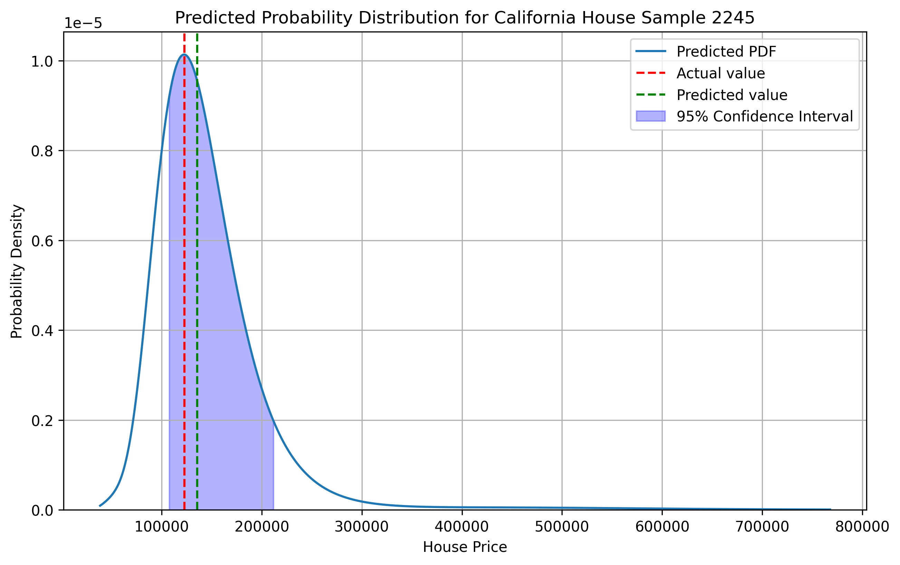
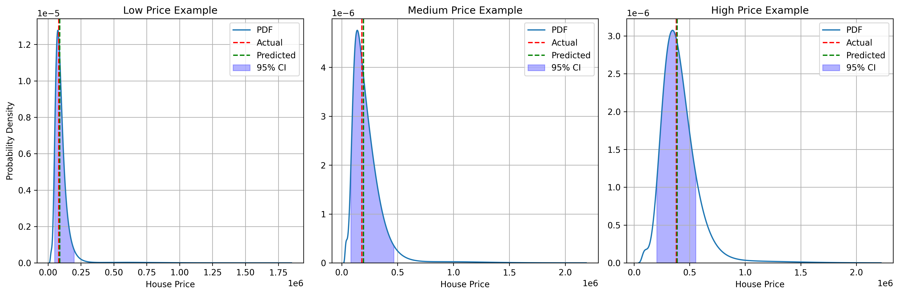
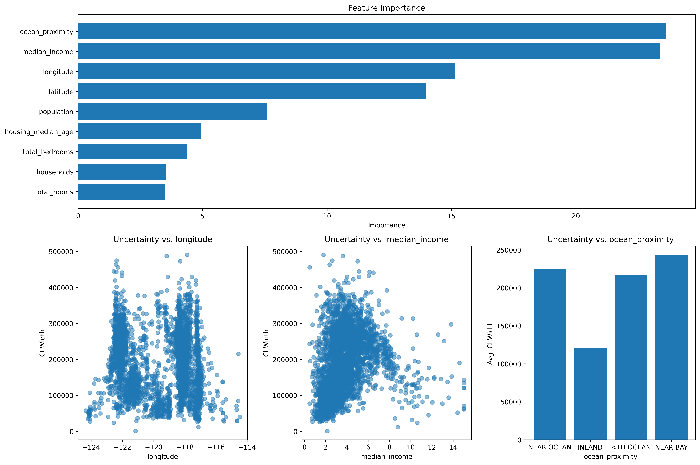
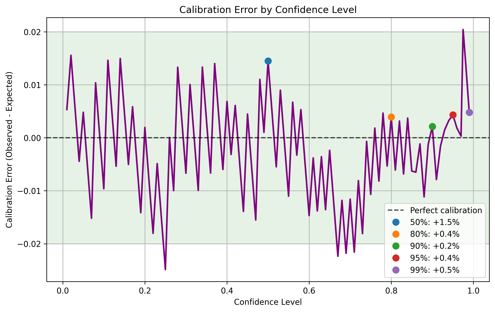

# ProbGBT: Probabilistic Gradient Boosted Trees

ProbGBT is a fully nonparametric probabilistic machine learning model that extends gradient boosted trees to provide uncertainty estimates. It uses CatBoost's MultiQuantile loss function to predict multiple quantiles of the target distribution, then constructs a probability density function (PDF) from these quantiles without making any assumptions about the underlying distribution shape.

## Features

- **Uncertainty Estimation**: Provides confidence intervals and probability distributions for predictions
- **Non-parametric**: Makes no assumptions about the shape of the target distribution
- **Flexible**: Works with both numerical and categorical features
- **Efficient**: Built on top of CatBoost's fast gradient boosting implementation
- **Multiple Training Strategies**: Supports both single model with MultiQuantile loss and separate models for each quantile
- **Calibrated Predictions**: Uses conformal prediction to ensure statistically valid confidence intervals

## Example Visualizations

### Predictions with Confidence Intervals



*Scatter plot showing predicted vs actual values with 95% confidence intervals for selected samples.*

### Probability Density Functions

<table>
  <tr>
    <td></td>
  </tr>
  <tr>
    <td></td>
  </tr>
</table>

*Top: Detailed probability density function for a single example, showing the predicted distribution, actual value, and 95% confidence interval.*

*Bottom: PDFs for houses in different price ranges (low, medium, high), demonstrating how the model captures different uncertainty patterns.*

### Uncertainty Analysis


*Relationship between confidence interval width and prediction error, showing how larger uncertainty correlates with larger errors.*



*Feature importance and its relationship with prediction uncertainty, demonstrating which features contribute most to the model's predictions and uncertainty.*

### Calibration Analysis

<table>
  <tr>
    <td></td>
  </tr>
  <tr>
    <td></td>
  </tr>
</table>

*Top: Calibration plot showing the relationship between expected coverage (confidence level) and observed coverage. The blue line represents the observed coverage at different confidence levels, while the dashed black line indicates perfect calibration. The plot also shows how confidence interval width increases with confidence level.*

*Bottom: Calibration error plot showing the difference between observed and expected coverage across confidence levels. Points highlight key confidence levels (50%, 80%, 90%, 95%, 99%), and the green band indicates an acceptable error range of ±2%. This plot helps identify where the model might be over-confident (negative values) or under-confident (positive values).*

The calibration analysis is crucial for assessing the reliability of the model's uncertainty estimates:

1. **Perfect calibration** would follow the diagonal line in the calibration plot, meaning that for any confidence level α, exactly α% of the true values fall within the predicted intervals.

2. **Over-confidence** occurs when the blue line falls below the diagonal, indicating that the predicted intervals are too narrow and contain fewer true values than expected.

3. **Under-confidence** occurs when the blue line is above the diagonal, indicating that the predicted intervals are unnecessarily wide.

4. **The calibration error plot** makes it easier to identify miscalibration patterns across different confidence levels, with values closer to zero indicating better calibration.

5. **Confidence interval width** (shown in the bottom part of the calibration plot) typically increases as the confidence level increases, but the rate of increase can reveal patterns in the model's uncertainty estimation.

ProbGBT's conformal calibration mechanism aims to ensure that the calibration curve stays close to the diagonal, providing statistically valid uncertainty estimates.

## Installation

```bash
# Clone the repository
git clone https://github.com/yourusername/ProbGBT.git
cd ProbGBT

# Install dependencies
pip install -r requirements.txt
```

Or using Poetry:

```bash
# Install dependencies with Poetry
poetry install
```

## Dependencies

- numpy
- pandas
- catboost
- scipy
- scikit-learn
- pygam
- matplotlib
- tqdm

## Usage

For detailed usage examples, please refer to the example files in the `examples/` directory.

### Running Examples

You can run the examples using:

```bash
# Using Python directly
python examples/run_example.py

# Using Poetry
poetry run python examples/run_example.py
# Or, if configured in pyproject.toml
poetry run run-example
```

This will:
1. Load the California housing prices dataset
2. Train a ProbGBT model
3. Make predictions with uncertainty estimates
4. Calculate performance metrics
5. Generate visualizations in the 'images' directory

## How It Works

ProbGBT works by:

1. **Quantile Transformation**: Generating non-uniformly spaced quantiles with more focus on the tails of the distribution
2. **Multi-Quantile Regression**: Training a CatBoost model to predict multiple quantiles simultaneously (or separate models for each quantile)
3. **Smoothing**: Using Generalized Additive Models (GAMs) to smooth the quantile function
4. **PDF Estimation**: Computing the derivative of the smoothed quantile function to obtain the probability density function
5. **Calibration** (optional): Using conformal prediction to ensure statistical validity of the confidence intervals

### Technical Details on PDF Generation

The PDF generation process in ProbGBT involves several sophisticated steps:

1. **Non-uniform Quantile Generation**: 
   - Instead of using uniformly spaced quantiles, ProbGBT transforms them using the normal distribution's PPF (Percent Point Function) and CDF (Cumulative Distribution Function)
   - This places more focus on the tails of the distribution, improving the model's ability to capture extreme values
   - The transformation uses: `non_uniform_quantiles = norm.cdf(norm.ppf(uniform_quantiles) * 1.5)`

2. **Quantile Prediction with CatBoost**:
   - The model can use either:
     - CatBoost's MultiQuantile loss function to predict all quantiles simultaneously (default)
     - Separate CatBoost models for each quantile (when `train_separate_models=True`)
   - The first approach ensures consistency between quantiles and improves computational efficiency
   - The second approach may provide more flexibility for complex distributions

3. **Quantile Function Smoothing**:
   - Raw quantile predictions can be noisy and may not form a proper monotonically increasing function
   - A Generalized Additive Model (GAM) with monotonicity constraints is fitted to the predicted quantiles:
     ```python
     gam = LinearGAM(s(0, constraints="monotonic_inc")).fit(quantiles, y_pred_sample)
     ```
   - This creates a smooth, monotonically increasing quantile function

4. **PDF Calculation**:
   - The PDF is computed as the derivative of the quantile function with respect to the probability
   - Mathematically, if Q(p) is the quantile function, then PDF(y) = 1/Q'(F(y)) where F is the CDF
   - In code, this is approximated using numerical differentiation:
     ```python
     pdf_smooth = np.gradient(quantiles_smooth, y_pred_smooth + epsilon)
     ```
   - The small epsilon value (1e-10) prevents division by zero in flat regions

5. **PDF Normalization**:
   - The resulting PDF is normalized to ensure it integrates to 1.0, making it a valid probability density function:
     ```python
     pdf_smooth /= np.trapz(pdf_smooth, y_pred_smooth)
     ```
   - This uses the trapezoidal rule for numerical integration

6. **Comparison of PDF Smoothing Methods**:
   ProbGBT offers three methods for smoothing the quantile predictions into PDFs, each with different characteristics:
   
   - **Sample-based KDE (`sample_kde`)**: The default method
     - Fully nonparametric approach that makes no assumptions about the distribution shape
     - Generates samples from the empirical CDF and applies Kernel Density Estimation
     - Produces the most flexible and accurate representations of complex distributions
     - Can effectively capture multi-modal distributions and asymmetric tails
     - Most computationally intensive method (slowest)
     - Prone to under confidence (distributions too wide), but effectively fixed with conformal calibration (enabled by default)
   
   - **Spline-based smoothing (`spline`)**:
     - Nonparametric approach that directly smooths the quantile function using splines
     - Fits a Generalized Additive Model (splines) with monotonicity constraints
     - Fastest method with lowest computational overhead
     - May produce peaky or irregular distributions in some cases
     - Recommended when no calibration is used: produces most calibrated distributions
   
   - **Gaussian Mixture Model (`gmm`)**:
     - Semi-parametric approach that combines spline smoothing with Gaussian mixtures
     - First applies spline-based smoothing, then fits a mixture of Gaussian distributions
     - Provides a good balance between flexibility and smoothness
     - Moderate computational cost (between `spline` and `sample_kde` in terms of speed)
     - Produces smoother distributions than the spline method
     - May not capture extremely complex distributions as well as `sample_kde`
     - When GMM is selected but fails to converge, spline results are used instead

   The choice of smoothing method depends on your specific needs:
      - Use `sample_kde` (default) for the most accurate representation when computational cost is not a concern
      - Use `spline` for the fastest performance when dealing with large datasets or no calibration is used
      - Use `gmm` for a good balance between smooth distributions and reasonable performance

### Calibration Process

The calibration feature in ProbGBT uses conformal prediction to ensure that the predicted confidence intervals have the correct coverage probability. Here's how it works:

1. **Calibration Set Creation**:
   - During training, a calibration set is required to compute nonconformity scores
   - ProbGBT supports two approaches for obtaining this calibration set:
     
     a) **Automatic Splitting** (when `calibration_set=None`):
     - A portion of the training data is reserved for calibration (`calibration_size` parameter, default: 0.2)
     - The data is randomly shuffled (controlled by `random_seed`)
     - The first `calibration_size` fraction becomes the calibration set
     - The model is trained on the remaining (1-`calibration_size`) fraction
     - This approach is simple but reduces the effective training set size
     
     b) **Separate Calibration Set** (when `calibration_set=(X_cal, y_cal)`):
     - You provide a pre-defined calibration dataset
     - The model is trained on the full training set
     - Calibration is performed using the provided calibration set
     - This approach is better when you have sufficient data or for time series where random splitting is inappropriate
     - The calibration set should ideally come from the same distribution as the training data

2. **Nonconformity Scores**:
   - For each quantile level α, the model computes nonconformity scores on the calibration set
   - For the quantile q_α(X), the nonconformity score is: E_i = y_i - q_α(X_i)
   - These scores represent how much the true values deviate from the predicted quantiles

3. **Empirical Quantile Adjustment**:
   - For each desired quantile level α, the model finds s_hat such that:
     P(y - q_α(X) ≤ s_hat) = α
   - This is calculated as the empirical (n+1)α/n quantile of the nonconformity scores
   - The adjusted prediction is then: q_α_cal(X) = q_α(X) + s_hat

4. **Interval Calculation**:
   - For calibrated models, confidence intervals directly use the calibrated quantiles
   - For a (1-α) confidence interval, the lower bound uses the α/2 quantile and the upper bound uses the (1-α/2) quantile
   - These intervals have a theoretical guarantee to include the true value with at least the specified probability

5. **PDF from Calibrated Quantiles**:
   - When `use_calibration=True` in `predict_pdf()`, the smoothed PDF is constructed from the calibrated quantiles
   - This ensures the PDF is consistent with the calibrated confidence intervals
   - The resulting PDFs maintain statistical validity while providing smooth, continuous distributions

The calibration process ensures that the model's uncertainty predictions are statistically valid and well-calibrated. This is particularly important in high-stakes applications where reliable uncertainty estimates are critical.

## API Reference

### ProbGBT Class

```python
ProbGBT(
    num_quantiles=50,
    iterations=500,
    learning_rate=None,
    depth=None,
    subsample=1.0,
    random_seed=42,
    train_separate_models=False,
    calibrate=False
)
```

#### Parameters:

- `num_quantiles`: Number of quantiles to predict (default: 50)
- `iterations`: Maximum number of trees to build (default: 500)
- `learning_rate`: Learning rate for the gradient boosting algorithm (default: None, uses CatBoost default)
- `depth`: Depth of the trees (default: None, uses CatBoost default)
- `subsample`: Subsample ratio of the training instances (default: 1.0)
- `random_seed`: Random seed for reproducibility (default: 42)
- `train_separate_models`: If True, train separate models for each quantile instead of using MultiQuantile loss (default: False)
- `calibrate`: If True, use conformal prediction to calibrate predicted quantiles (default: False)

#### Methods:

- `train(X, y, cat_features=None, eval_set=None, use_best_model=True, verbose=True, calibration_set=None, calibration_size=0.2)`: Train the model
- `predict_raw(X)`: Get raw quantile predictions (with calibration applied if enabled)
- `predict(X, method='sample_kde', num_points=1000)`: Predict probability density functions and CDFs for the given samples
- `evaluate_calibration(X_val, y_val, confidence_levels=None)`: Evaluate calibration quality on validation data
- `save(filepath, format='cbm', compression_level=6)`: Save the trained model to a file
- `load(filepath, format='cbm')`: Load a saved model from a file

**Note:** The following methods have been removed in the newest version, as their functionality is now integrated directly into the predict() method combined with helper functions:
- `predict_interval`: Use predict() and calculate confidence intervals from the returned CDFs
- `predict_pdf`: Use predict() directly
- `predict_distribution`: Use predict() and calculate statistics from the returned distributions

> **API Changes in v2.0**
> 
> The ProbGBT API has been refactored to be more efficient and flexible:
>
> 1. The `predict()` method now returns a list of tuples: `[(x_values, pdf_values, cdf_values), ...]` for each sample, providing both PDF and CDF in a single call.
> 
> 2. The `predict_raw()` method returns the raw quantile predictions (with calibration applied if enabled). For calibrated models, getting confidence intervals directly from these raw quantiles is more accurate.
>
> 3. Statistics and intervals are calculated from the distributions rather than making separate API calls. This approach is more efficient because it computes the distribution only once.
>
> 4. The default smoothing method is now `sample_kde`, which produces higher quality PDFs, especially for complex distributions.
>
> See the examples above for how to calculate medians and confidence intervals using the new API.

### Save and Load Functionality

ProbGBT models can be saved to disk and loaded later for inference:

```python
# Save a trained model
model.save("model.cbm")  # For single model approach
model.save("models.tar.xz")  # For separate models approach

# Load a model
loaded_model = ProbGBT()
loaded_model.load("model.cbm")  # Load single model
loaded_model.load("models.tar.xz")  # Load separate models
```

#### Save Method

```python
save(filepath, format='cbm', compression_level=6)
```

- `filepath`: Path to save the model. For separate models, use a `.tar.xz` extension.
- `format`: Format for saving individual models. Options: 'cbm' (CatBoost binary), 'json'
- `compression_level`: Compression level for xz compression (1-9, where 9 is highest). Only used with separate models.

For the single model approach (when `train_separate_models=False`), this uses CatBoost's native `save_model` method.
For the separate models approach (when `train_separate_models=True`), this saves each model separately and compresses them into a tar.xz file with progress bars for monitoring.

#### Load Method

```python
load(filepath, format='cbm')
```

- `filepath`: Path to the saved model file.
- `format`: Format of the saved model. Only used for loading individual models from a tar.xz archive.

The method automatically detects whether the file is a single model or an archive of separate models based on the file extension.

## License

MIT