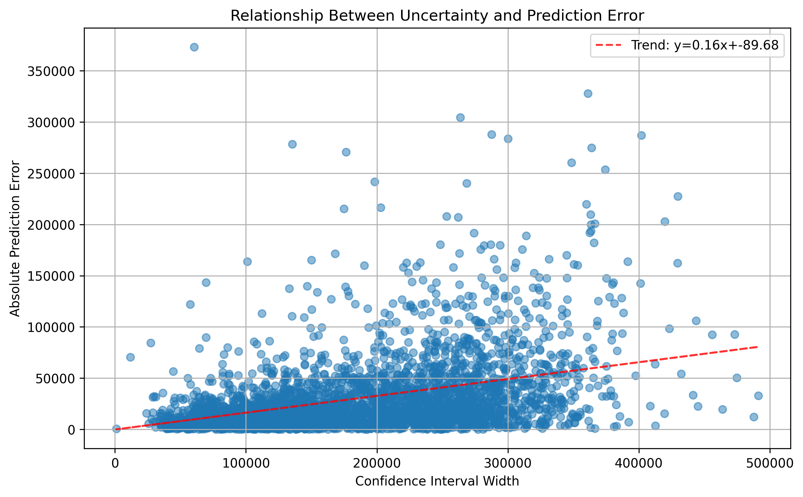
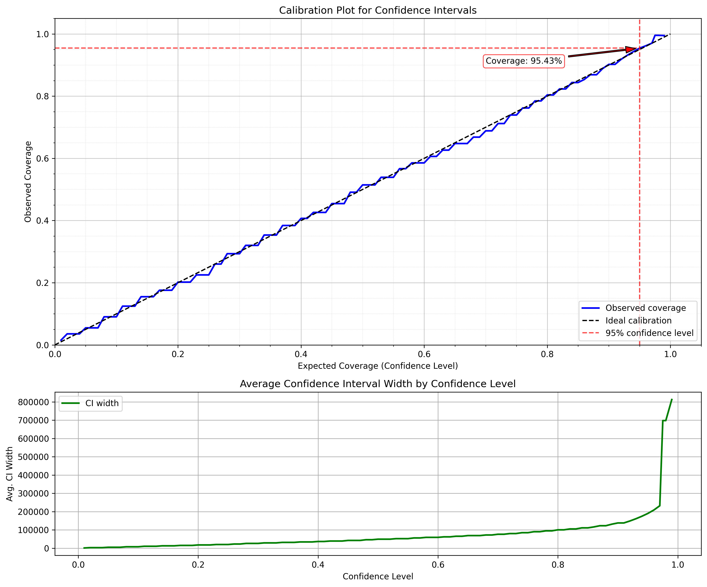

# ProbGBT: Probabilistic Gradient Boosted Trees

ProbGBT is a probabilistic machine learning model that extends gradient boosted trees to provide uncertainty estimates. It uses CatBoost's MultiQuantile loss function to predict multiple quantiles of the target distribution, then constructs a probability density function (PDF) from these quantiles.

## Features

- **Uncertainty Estimation**: Provides confidence intervals and probability distributions for predictions
- **Non-parametric**: Makes no assumptions about the shape of the target distribution
- **Flexible**: Works with both numerical and categorical features
- **Efficient**: Built on top of CatBoost's fast gradient boosting implementation
- **Multiple Training Strategies**: Supports both single model with MultiQuantile loss and separate models for each quantile
- **CRPS Validation**: Supports Continuous Ranked Probability Score (CRPS) for model validation and early stopping

## Example Visualizations

### Predictions with Confidence Intervals


*Scatter plot showing predicted vs actual values with 95% confidence intervals for selected samples.*

### Probability Density Functions

<table>
  <tr>
    <td></td>
  </tr>
  <tr>
    <td></td>
  </tr>
</table>

*Top: Detailed probability density function for a single example, showing the predicted distribution, actual value, and 95% confidence interval.*

*Bottom: PDFs for houses in different price ranges (low, medium, high), demonstrating how the model captures different uncertainty patterns.*

### Uncertainty Analysis



*Relationship between confidence interval width and prediction error, showing how larger uncertainty correlates with larger errors.*


*Feature importance and its relationship with prediction uncertainty, demonstrating which features contribute most to the model's predictions and uncertainty.*



*Calibration plot showing how well the predicted confidence intervals match the observed coverage, with a focus on the 95% confidence level.*

## Installation

```bash
# Clone the repository
git clone https://github.com/yourusername/ProbGBT.git
cd ProbGBT

# Install dependencies
pip install -r requirements.txt
```

Or using Poetry:

```bash
# Install dependencies with Poetry
poetry install

# Run the example
poetry run run-example
```

## Dependencies

- numpy
- pandas
- catboost
- scipy
- scikit-learn
- pygam
- matplotlib
- tqdm

## Usage

### Basic Example

```python
from prob_gbt import ProbGBT
from sklearn.model_selection import train_test_split

# Prepare your data
X_train, X_test, y_train, y_test = train_test_split(X, y, test_size=0.2)

# Initialize and train the model
model = ProbGBT(num_quantiles=50, iterations=500, train_separate_models=False)
model.train(X_train, y_train, cat_features=cat_features)

# Make point predictions
y_pred = model.predict(X_test)

# Get confidence intervals
lower_bounds, upper_bounds = model.predict_interval(X_test, confidence_level=0.95)

# Get full probability distributions
pdfs = model.predict_pdf(X_test)

# Evaluate CRPS on test data
crps = model.evaluate_crps(X_test, y_test)
```

### Training with CRPS Validation

The Continuous Ranked Probability Score (CRPS) is a proper scoring rule that measures the quality of probabilistic forecasts. It's particularly well-suited for evaluating probabilistic regression models.

```python
# Initialize model with CRPS validation
model = ProbGBT(
    num_quantiles=50, 
    iterations=500,
    train_separate_models=False,
    use_crps=True,              # Enable CRPS validation during training
    crps_eval_freq=10,          # Evaluate CRPS every 10 iterations
    crps_val_subset=0.5         # Use 50% of validation data for CRPS calculation
)

# Train with CRPS early stopping
model.train(
    X_train, 
    y_train,
    cat_features=cat_features,
    eval_set=(X_val, y_val),    # Validation data is required for CRPS
    early_stopping_rounds=30,   # Stop training if no improvement for 30 iterations
    crps_early_stopping=True    # Use CRPS for early stopping instead of default metric
)

# Get CRPS history during training
crps_history = model.get_crps_history()
```

### Example CRPS Script

The repository includes an example script demonstrating CRPS usage:

```bash
# Using Python directly
python -m prob_gbt.example_crps

# Using Poetry
poetry run python -m prob_gbt.example_crps
```

This will:
1. Train a model with CRPS validation
2. Train a model with CRPS early stopping
3. Compare different models using RMSE and CRPS metrics
4. Plot CRPS evolution during training
5. Save the best model based on CRPS

## How It Works

ProbGBT works by:

1. **Quantile Transformation**: Generating non-uniformly spaced quantiles with more focus on the tails of the distribution
2. **Multi-Quantile Regression**: Training a CatBoost model to predict multiple quantiles simultaneously (or separate models for each quantile)
3. **Smoothing**: Using Generalized Additive Models (GAMs) to smooth the quantile function
4. **PDF Estimation**: Computing the derivative of the smoothed quantile function to obtain the probability density function

### Technical Details on PDF Generation

The PDF generation process in ProbGBT involves several sophisticated steps:

1. **Non-uniform Quantile Generation**: 
   - Instead of using uniformly spaced quantiles, ProbGBT transforms them using the normal distribution's PPF (Percent Point Function) and CDF (Cumulative Distribution Function)
   - This places more focus on the tails of the distribution, improving the model's ability to capture extreme values
   - The transformation uses: `non_uniform_quantiles = norm.cdf(norm.ppf(uniform_quantiles) * 3)`

2. **Quantile Prediction with CatBoost**:
   - The model can use either:
     - CatBoost's MultiQuantile loss function to predict all quantiles simultaneously (default)
     - Separate CatBoost models for each quantile (when `train_separate_models=True`)
   - The first approach ensures consistency between quantiles and improves computational efficiency
   - The second approach may provide more flexibility for complex distributions

3. **Quantile Function Smoothing**:
   - Raw quantile predictions can be noisy and may not form a proper monotonically increasing function
   - A Generalized Additive Model (GAM) with monotonicity constraints is fitted to the predicted quantiles:
     ```python
     gam = LinearGAM(s(0, constraints="monotonic_inc")).fit(quantiles, y_pred_sample)
     ```
   - This creates a smooth, monotonically increasing quantile function

4. **PDF Calculation**:
   - The PDF is computed as the derivative of the quantile function with respect to the probability
   - Mathematically, if Q(p) is the quantile function, then PDF(y) = 1/Q'(F(y)) where F is the CDF
   - In code, this is approximated using numerical differentiation:
     ```python
     pdf_smooth = np.gradient(quantiles_smooth, y_pred_smooth + epsilon)
     ```
   - The small epsilon value (1e-10) prevents division by zero in flat regions

5. **PDF Normalization**:
   - The resulting PDF is normalized to ensure it integrates to 1.0, making it a valid probability density function:
     ```python
     pdf_smooth /= np.trapz(pdf_smooth, y_pred_smooth)
     ```
   - This uses the trapezoidal rule for numerical integration

This approach allows ProbGBT to generate flexible, non-parametric probability distributions that can capture complex uncertainty patterns in the data, including multi-modal distributions, skewness, and heteroscedasticity.

## API Reference

### ProbGBT Class

```python
ProbGBT(
    num_quantiles=50,
    iterations=500,
    learning_rate=None,
    depth=None,
    subsample=1.0,
    random_seed=42,
    train_separate_models=False,
    use_crps=False,
    crps_eval_freq=10,
    crps_val_subset=1.0
)
```

#### Parameters:

- `num_quantiles`: Number of quantiles to predict (default: 50)
- `iterations`: Maximum number of trees to build (default: 500)
- `learning_rate`: Learning rate for the gradient boosting algorithm (default: None, uses CatBoost default)
- `depth`: Depth of the trees (default: None, uses CatBoost default)
- `subsample`: Subsample ratio of the training instances (default: 1.0)
- `random_seed`: Random seed for reproducibility (default: 42)
- `train_separate_models`: If True, train separate models for each quantile instead of using MultiQuantile loss (default: False)
- `use_crps`: If True, compute CRPS during training (default: False). Only available when train_separate_models=False and eval_set is provided.
- `crps_eval_freq`: Frequency (in epochs) to evaluate CRPS during training (default: 10)
- `crps_val_subset`: Fraction of validation data to use for CRPS calculation (default: 1.0). Lower values speed up computation.

#### Methods:

- `train(X, y, cat_features=None, eval_set=None, use_best_model=True, verbose=True, early_stopping_rounds=None, crps_early_stopping=False)`: Train the model
- `predict(X, return_quantiles=False)`: Make predictions
- `predict_interval(X, confidence_level=0.95)`: Predict confidence intervals
- `predict_pdf(X, num_points=1000)`: Predict probability density functions
- `evaluate_crps(X, y, subset_fraction=1.0, num_points=1000, verbose=True)`: Evaluate CRPS on test data
- `get_crps_history()`: Get history of CRPS values during training
- `save(filepath, format='cbm', compression_level=6)`: Save the trained model to a file
- `load(filepath, format='cbm')`: Load a saved model from a file

### CRPS Evaluation

The CRPS (Continuous Ranked Probability Score) is a proper scoring rule that measures the quality of probabilistic forecasts. A lower CRPS value indicates better probabilistic predictions.

```python
# Evaluate CRPS on test data
crps = model.evaluate_crps(
    X_test, 
    y_test, 
    subset_fraction=1.0,  # Use all test data
    num_points=1000,      # Number of points for PDF smoothing
    verbose=True          # Print progress information
)
```

#### Benefits of CRPS:

1. **Proper Scoring Rule**: CRPS is a proper scoring rule, meaning it encourages truthful forecasts.
2. **Distribution Awareness**: Unlike RMSE, CRPS evaluates the entire predicted distribution, not just point estimates.
3. **Calibration Sensitivity**: CRPS is sensitive to both calibration (whether confidence intervals have proper coverage) and sharpness (how narrow the predictions are).
4. **No Parametric Assumptions**: Works with any distribution shape, not just normal distributions.
5. **Interpretable Units**: CRPS is in the same units as the target variable, making it directly interpretable.

#### Technical Implementation:

The CRPS implementation fits a GAM to smooth the quantile function, computes the PDF from it, and uses properscoring's `crps_ensemble` function to calculate the final score.

## License

MIT

## Acknowledgements

This implementation is based on the concepts of quantile regression and uncertainty estimation in gradient boosted trees.